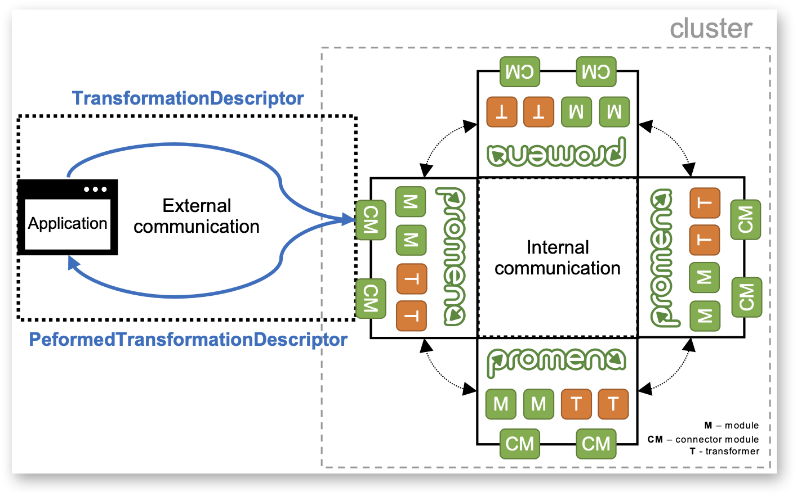
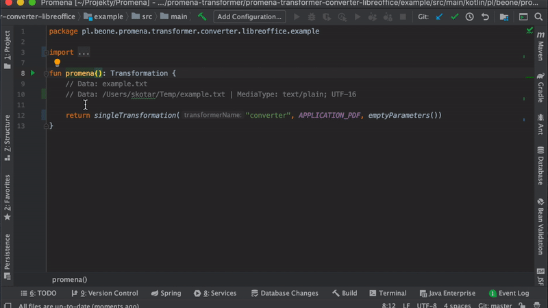

# 
The modular general-purpose transformation system, perfectly suited to Alfresco.

##  Motivation
As one of the steps in a task execution, applications sometimes have to perform "heavy" long-running operations such as document converting, OCR, report generating or email sending. Executing such tasks within an application cause increase in its responsibility and consequently code complexity, 3rd party tools integration, error handling, scalability problem, queuing etc.

Promena is the transformation system that allows to delegate a task and receive the result of its execution. 

## [Sample](https://github.com/BeOne-PL/promena-sample)
There are samples of:
* building Promena
* deployment
* transformers and modules
* integration with Alfresco

## [Alfresco](https://github.com/BeOne-PL/promena-alfresco)
This repository contains Alfresco Content Services modules that are required to integrate Alfresco with Promena.

## Flow


A connector module doesn't have to be implemented directly on Promena. It can be, for example, a message broker which is a layer between an application and Promena connector module.

### Application
1. Send to Promena using a connector module (see [Connector](#connector)):
    * In case of serialization - serialized [`TransformationDescriptor`](./base/promena-core/application-model/application-model/src/main/kotlin/pl/beone/promena/core/applicationmodel/transformation/TransformationDescriptor.kt)
    * Without serialization - data required to construct [`TransformationDescriptor`](./base/promena-core/application-model/application-model/src/main/kotlin/pl/beone/promena/core/applicationmodel/transformation/TransformationDescriptor.kt) on Promena side
2. Receive from Promena using given connector module:
    * In case of serialization - serialized [`PerformedTransformationDescriptor`](./base/promena-core/application-model/application-model/src/main/kotlin/pl/beone/promena/core/applicationmodel/transformation/PerformedTransformationDescriptor.kt)
    * Without serialization - data required to construct [`PerformedTransformationDescriptor`](./base/promena-core/application-model/application-model/src/main/kotlin/pl/beone/promena/core/applicationmodel/transformation/PerformedTransformationDescriptor.kt) on the application side

### Promena
1. Receives on the connector (see [Connector](#connector)):
    * In case of serialization - serialized [`TransformationDescriptor`](./base/promena-core/application-model/application-model/src/main/kotlin/pl/beone/promena/core/applicationmodel/transformation/TransformationDescriptor.kt)
    * Without serialization - data required to construct [`TransformationDescriptor`](./base/promena-core/application-model/application-model/src/main/kotlin/pl/beone/promena/core/applicationmodel/transformation/TransformationDescriptor.kt) on Promena side
2. Converts [`Data`](./base/promena-transformer/contract/src/main/kotlin/pl/beone/promena/transformer/contract/model/data/Data.kt) of [`TransformationDescriptor`](./base/promena-core/application-model/application-model/src/main/kotlin/pl/beone/promena/core/applicationmodel/transformation/TransformationDescriptor.kt) from external communication to internal communication (see [Communication](#communication))
2. Performs a transformation using transformers (see [Transformer](#transformer))
    * Transformation can be composed of many transformers. Each transformer can be located on a different node
3. Converts transformed [`Data`](./base/promena-transformer/contract/src/main/kotlin/pl/beone/promena/transformer/contract/model/data/Data.kt) from internal communication to external communication
4. Sends to the application using given connector module:
    * In case of serialization - serialized [`PerformedTransformationDescriptor`](./base/promena-core/application-model/application-model/src/main/kotlin/pl/beone/promena/core/applicationmodel/transformation/PerformedTransformationDescriptor.kt)
    * Without serialization - data required to construct [`PerformedTransformationDescriptor`](./base/promena-core/application-model/application-model/src/main/kotlin/pl/beone/promena/core/applicationmodel/transformation/PerformedTransformationDescriptor.kt) on the application side

## Module
The functionality of Promena can be extended by modules. Modules are added in the build stage of Promena (see [Building](#building)). 

Special cases of modules are, as mentioned earlier, connector module, communication module and actor creator module.

Visit [Sample#Module](https://github.com/BeOne-PL/promena-sample#module) to see examples of modules and [Development Guide](./DEVELOPMENT-GUIDE.md) to implement a custom module.

### Actor creator
Promena is based on Akka so it's required to specify the way of creating actors. The presence of exactly one [`ActorCreator`](./base/promena-core/application-model/application-model/src/main/kotlin/pl/beone/promena/core/applicationmodel/transformation/PerformedTransformationDescriptor.kt) implementation is required.

| Name | Description |
|----------|---------|
| [`promena-actor-creator-adaptive-load-balancing`](./module/actor-creator/adaptive-load-balancing) | Performs load balancing of messages to cluster nodes based on the cluster metrics data and chooses mailbox with fewest messages locally |

### Communication
The role of communication was described in [Flow](#flow) section. Promena distinguishes two types of communication:
* External - the communication between an application and Promena. The application determines the kind of this communication. The presence of at least one external communication is required
* Internal -  the communication that determines the way of sharing data between Promena nodes. The presence of exactly one [`InternalCommunicationConverter`](./base/promena-core/contract/contract/src/main/kotlin/pl/beone/promena/core/contract/communication/internal/InternalCommunicationConverter.kt) implementation and exatly one [`InternalCommunicationCleaner`](./base/promena-core/contract/contract/src/main/kotlin/pl/beone/promena/core/contract/communication/internal/InternalCommunicationCleaner.kt) implementation is required

| Name | Description |
|----------|---------|
| [`promena-communication-file`](./module/communication/file) | Shares data using files placed in common location (internal and external) - preferred for production use |
| [`promena-communication-memory`](./module/communication/memory) | Shares data using memory (internal and external) |

### Connector
The role of a connector was described in [Flow](#flow) section. It's a bridge between an application and Promena.

| Name | Description |
|----------|---------|
| [`promena-connector-activemq`](./module/connector/activemq) | Transfers *serialized* data using ActiveMQ - preferred for production use |
| [`promena-connector-http`](./module/connector/http) | Transfers *serialized* data using HTTP |
| [`promena-connector-normal-http`](./module/connector/normal-http) | Transfers data using normal HTTP |

## Transformer
A transformer is the fundamental element of Promena ecosystem. Every Promena executable can contain many transformers (at least one is required). The transformer responsibility is performing given transformation.

Each transformer implements [`Transformer`](./base/promena-transformer/contract/src/main/kotlin/pl/beone/promena/transformer/contract/Transformer.kt) and is identified by *name* and *sub name* ([`TransformerId`](./base/promena-transformer/contract/src/main/kotlin/pl/beone/promena/transformer/contract/transformer/TransformerId.kt)). The *name* describes the kind of a transformation (`converter` for example) and the *sub name* describes implementation details (`LibreOffice` for example). Each transformer also determines if it's able to perform given transformation - before a transformation Promena asks transformer if it's able to do it with given transformation parameters.
 
Promena groups transformers by their name. This means that an application can delegate a task using only *name*. It implicates that an application doesn't have to know transformers implementation details. An application also may pass *sub name* if it wants to perform given transformation on the specific transformer.

It may happen that many transformers can perform given transformation (if you passed only *name*), therefore, you can set the priority of each transformer. A priority is described by the value (a lower value indicates a higher priority). Visit the transformer repository to see how to set the transformer priority.

Promena can run many instances of transformers within one instance. Promena runs only one instance of each transformer by default but you can change it by increasing the number of actors. Visit the transformer repository to see how to set the number of transformer actors. It isn't the recommended way of scaling Promena. A better idea is to scale out Promena instances.

Promena resolves transformations. An application doesn't know if given transformation is included in Promena - it will get appropriate information as the response. If you want to find it out on an application side, you can do it using `application-model` dependency. Each transformer contains `application-model`. It includes transformer constants, you can check if the transformer supports given media type and parameters before sending a transformation. Unfortunately, it has disadvantages. It decreases the level of loose coupling and you don't know if given transformer is included in Promena.
 
Each transformer can by tweaked by parameters. Parameters describe a transformation. In case of lack of parameters, a transformer should use default parameters. Visit a transformer repository (Properties section) to find out how to set default parameters.
 
Each transformer repository contains `example` module. It contains the examples of transformations that you can execute using [IntelliJ plugin](#intellij-plugin).

Transformation character is often associated with the use of 3rd party tools. Additionally, each transformer may contain `Dockerfile-fragment` that is used to build Promena.

Visit [Sample#Transformer](https://github.com/BeOne-PL/promena-sample#transformer) to see the examples of transformers and [Development Guide](./DEVELOPMENT-GUIDE.md) to implement a custom transformer.

| Name | Description |
|----------|---------|
| [`converter-libreoffice`](https://github.com/BeOne-PL/promena-transformer-converter-libreoffice) | Based on LibreOffice - converts documents |
| [`converter-imagemagick`](https://github.com/BeOne-PL/promena-transformer-converter-imagemagick) | Based on ImageMagick - converts images |
| [`ocr-ocrmypdf`](https://github.com/BeOne-PL/promena-transformer-ocr-ocrmypdf) | Based on OCRmyPDF - OCR documents |
| [`barcode-detector-zxing-opencv`](https://github.com/BeOne-PL/promena-transformer-barcode-detector-zxing-opencv) | Based on ZXing & OpenCV - detects barcodes in documents and returns information about them |
| [`page-extractor-pdfbox`](https://github.com/BeOne-PL/promena-transformer-page-extractor-pdfbox) | Based on PDFBox - extract pages from documents |
| [`report-generator-jasperreport`](https://github.com/BeOne-PL/promena-transformer-report-generator-jasperreports) | Based on JasperReports - generates reports |

## Building
A base project to build Promena you can generate by executing: 

```
mvn archetype:generate -B \
    -DarchetypeGroupId=pl.beone.promena.sdk.maven.archetype \
    -DarchetypeArtifactId=promena-executable-archetype \
    -DarchetypeVersion=1.0.0 \
    -DgroupId=<group id> \
    -DartifactId=<artifact id> \
    -Dpackage=<package> \
    -Dversion=<version>
```

Generated `pom.xml` contains the following modules:
* Actor creator: [`promena-actor-creator-adaptive-load-balancing`](./module/actor-creator/adaptive-load-balancing)
* External communication: [`promena-communication-memory-external`](./module/communication/memory/external), [`promena-communication-file-external`](./module/communication/file/external)
* Internal communication: [`promena-communication-memory-internal`](./module/communication/memory/internal)
* Connector: [`promena-connector-http`](./module/connector/http)

and doesn't contain any transformer. If you want to add a module or a transformer - visit its repository to get dependencies.

In order to build Promena, run `mvn clean package` on `pom.xml`. Java 11 JRE is required. You will get Promena Docker image and executable jar.

The default name of Docker image is `${promena-executable}:${project.version}` (you can change it in the configuration section of `promena-docker-maven-plugin` plugin). Executable jar is located in `target/${promena-executable}-${project.version}.jar`.

`promena-docker-maven-plugin` scans all plugin dependencies to find `docker/Dockerfile-fragment` files, and then concat them and build Promena Docker image based on `src/docker/Dockerfile` template.

Promena image provides the complete running environment (Promena executable jar and all 3rd party tools). Executable jar contains only the application.

Visit [Sample#Image](https://github.com/BeOne-PL/promena-sample#image) to see the examples of Promena Docker images.

### Run environment variables
Default `docker-entrypoint.sh` runs Promena with the following JVM parameters:
* `JAVA_OPTS_MEMORY` = `-XX:MinRAMPercentage=50 -XX:MaxRAMPercentage=80`
* `JAVA_OPTS_GC` = ` `
* `JAVA_OPTS_DEBUG_ENABLED` = `false`
* `JAVA_OPTS_DEBUG` = `-agentlib:jdwp=transport=dt_socket,address=*:9999,suspend=n,server=y`
* `JAVA_OPTS_ADDITIONAL` = `-Dfile.encoding=UTF-8 -Djava.security.egd=file:/dev/./urandom`
* `JAVA_OPTS_CUSTOM` = ` `

If `JAVA_OPTS_DEBUG_ENABLED` is `true`, Promena is run with `JAVA_OPTS_DEBUG` parameter.

## Properties
Properties can be set using environment variables. Promena is based on Spring Boot so many properties are common - [Spring Appendix - Core properties](https://docs.spring.io/spring-boot/docs/2.2.1.RELEASE/reference/html/appendix-application-properties.html#core-properties).

Each module and transformer provides its own set of properties. The list of properties you can find in their repositories.

Core properties available in every Promena executable:
```properties
# See https://doc.akka.io/docs/akka/2.5.26/cluster-usage.html for more details
akka.actor.provider=cluster
akka.remote.netty.tcp.hostname=127.0.0.1
akka.remote.netty.tcp.port=2552
akka.maximun-payload-size=${core.serializer.kryo.buffer-size}b
akka.remote.netty.tcp.message-frame-size=${akka.maximun-payload-size}
akka.remote.netty.tcp.send-buffer-size=${akka.maximun-payload-size}
akka.remote.netty.tcp.receive-buffer-size=${akka.maximun-payload-size}
akka.remote.netty.tcp.maximum-frame-size=${akka.maximun-payload-size}
akka.remote.maximum-payload-bytes=${akka.maximun-payload-size}

# Maximum time to complete a transformation by transformer
core.transformation.timeout=10m
# Additional time after timeout for transformer to stop transformation 
core.transformation.interruption-timeout-delay=5s
# Number of serializer actors. If not set, the number of serializer actors will be sum of transformer actors
core.serializer.actors=
# Maxium Kryo buffer size [bytes]
core.serializer.kryo.buffer-size=104857600

# Determines if transformation may be delegated to other transformer in cluster
core.transformer.actor.cluster-aware=true
# Determines if serialization may be delegated to other serializer in cluster
core.serializer.actor.cluster-aware=false

# If application uses external communication that isn't recognized by Promena, Promena will give a try to convert data using back-pressure communication
communication.external.manager.back-pressure.enabled=true
# Name of back-pressure communication
communication.external.manager.back-pressure.id=memory
```

## Deployment
Promena can be run in every environment with Docker support or in every environment with Java 11 JRE if you want to deploy Promena executable jar manually. 

Visit [Sample#Deployment](https://github.com/BeOne-PL/promena-sample#deployment) to see the example configurations of `manual`, `Kubernetes` and `OpenShift` deployment.

## IntelliJ plugin
It allows you to execute a transformation directly from IntelliJ on Promena. This plugin uses [`promena-connector-http`](./module/connector/http) connector module so it's required to include it on Promena.

Available on: https://plugins.jetbrains.com/plugin/13689-promena/. 

Visit [`mirror-jdk/example`](https://github.com/BeOne-PL/promena-sample/tree/master/transformer/mirror-jdk/example) to see Java and Kotlin examples.



### Data syntax
A function has to start with data declaration. It has to be a single line comment in the following format:
```
// Data: <absolute/resource path> [| MediaType: <mime type>; <charset>]
```
The part `[| MediaType: <mime type>; <charset>]` is optional. If it isn't specified, the plugin tries to discover media type automatically. 

Examples:
* `// Data: example.txt` - file `example.txt` from resources with media type that is discovered automatically
* `// Data: example.txt | MediaType: text/plain` - file `example.txt` from resources with MIME type `text/plain` and charset that is discovered automatically
* `// Data: /Users/skotar/Temp/example.txt | MediaType: text/plain; UTF-16` - file `example.txt` from absolute path with media type `text/plain; UTF-16`

There is no support for passing [`Metadata`](./base/promena-transformer/contract/src/main/kotlin/pl/beone/promena/transformer/contract/model/Metadata.kt) yet.

### Requirements
* The file must be in a module
* The file must have a package name
* The function must return [`Transformation`](./base/promena-transformer/contract/src/main/kotlin/pl/beone/promena/transformer/contract/transformation/Transformation.kt)

#### Kotlin
* The file must contain a function that name starts with **promena**

#### Java
* The file must contain a class
* The class must contain a static function that name starts with **promena**

## [Development Guide](./DEVELOPMENT-GUIDE.md)
This repository explains how Promena works internally and how to implement a custom module and transformer.